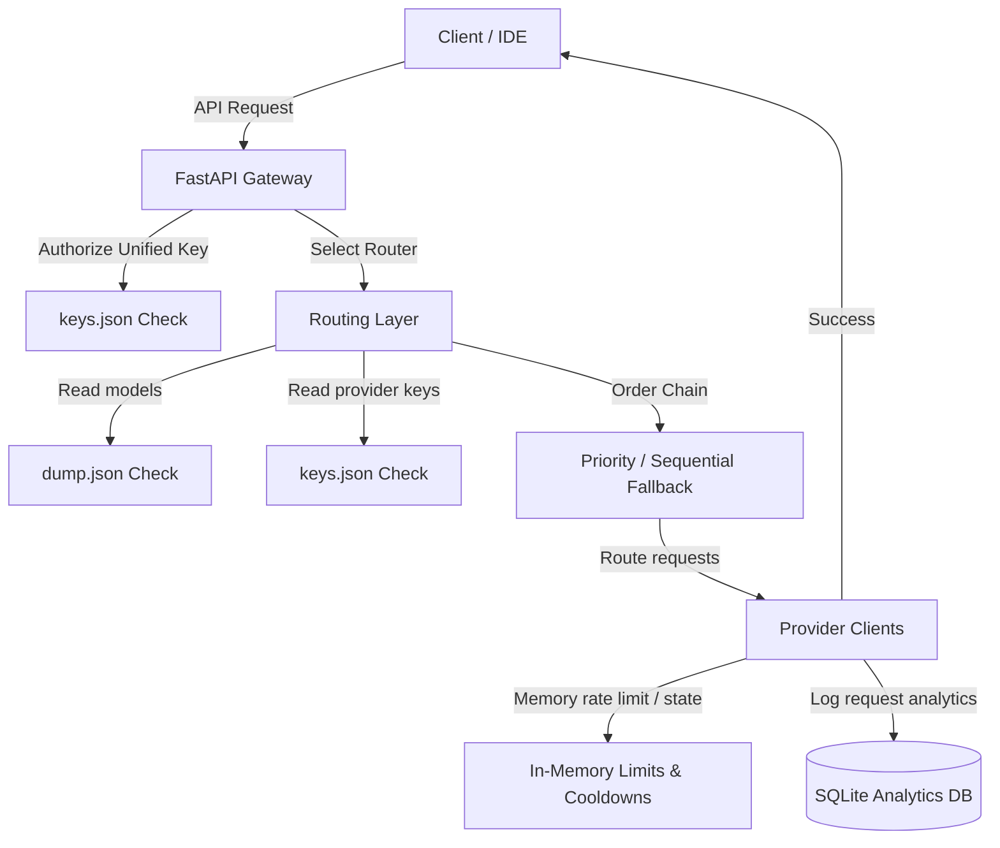

# System Architecture & Design

This document details the internal design, concurrency model, and routing algorithms behind **token-looter**.

## Design Overview

The system is built as a stateless ASGI proxy server written in **FastAPI** backed by **SQLite** *exclusively* for logging history and latency analytics. All client dashboard web server routing and authentication layers have been completely removed.

---

## Concurrency & Thread-Safety

To support concurrent REST requests safely:
1. **Thread-Safe In-Memory Cache**: Active cooldown targets and RPM/TPM sliding windows are stored inside thread-safe dicts wrapped by thread locks (`threading.Lock`).
2. **SQLite WAL Mode**: SQLite runs in WAL (Write-Ahead Logging) mode to prevent blocking writes when appending request logs while queries are processing.

---

## Failover Mechanics

When a request is routed, the engine executes it against the highest-priority model/key combination.
*   **Non-Retryable Errors** (e.g., Invalid JSON 400): Request fails immediately, error is returned to the client.
*   **Retryable Errors** (e.g., Rate Limits 429, Service Down 503, Timeouts, Auth 401):
    1.  The key is placed on a sliding **cooldown** window in memory.
    2.  The request is immediately retried on the next available API key or next-best model in the fallback chain.
